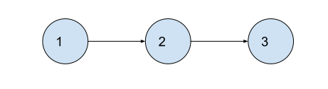
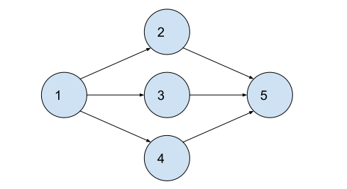

# Instructions  

The purpose of this exercise is to practice building a Graph using a Node class and perform a BFS on it.

Use this pattern to hold your graph...

```c++
class Node {
 public:
  Node(std::string name) : name(name) {}
  std::string name;
  // a vector of all the outgoing connections to other nodes.
  std::vector<Node*> children;
};

// a map holding all the nodes by their name.
std::map<std::string, Node> graph;
```

## Input / Output

First, an integer N will be given, then N strings follow indicating the names of the nodes.

Second, an integer M will be given, then M sets of two strings follow indicates edges between two nodes.

Third, a single string is given which indicates the node to start the BFS.

Your program must output the traversal pattern of a Breadth-First-Search starting at the node mentioned above.

## Example "one two three"

Input
```
3
one
two
three
2
one two
two three
one
```

Graph



Output
```
one
two
three
```

## Example "diamond"

Input
```
5
one
two
three
four
five
6
one two
one three
one four
two five
three five
four five
one
```

Graph




Output
```
one
two
three
four
five
```